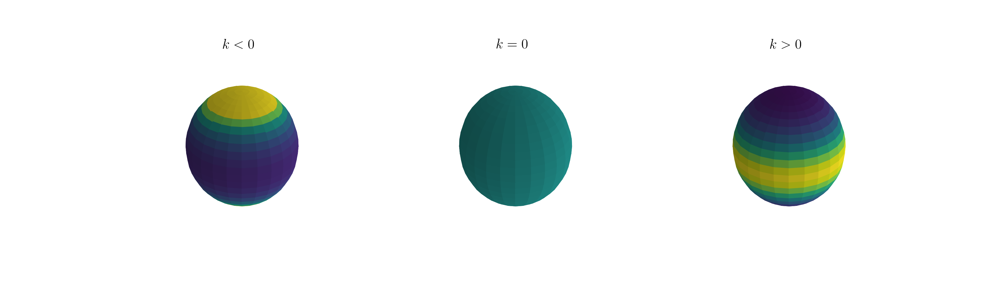

# Watson Distribution

This repository contains a subclass of the [rv_continuous](https://docs.scipy.org/doc/scipy/reference/generated/scipy.stats.rv_continuous.html) class in Scipy for the Dimroth-Watson distribution.

The Dimroth-Watson (or just 'Watson') distribution is a distribution for the spherical polar angles, theta (inclination) and phi (azimuth).  Phi is always a unfoirm random distribution.  Given this, this class is only designed for modeling the distribution of theta.  

This is a 1-parameter distribution, where the shape parameter, k, can take on values between negaitve infinity and positive infinity.  For k>0, the distribution takes the form of a girdle, for k=0 the distribution is uniform, and for k<0, the distribution is bi-polar on the surface of a sphere.  




## Description

The primary purpose for creating this class is to implement an effecient method to create random variates.  Currently, random variates are generated using the rejection-sampling technique because the inversion of the CDF is non-trivial.  Proposal distributions are taken from [Best & Fisher (1986)](https://onlinelibrary.wiley.com/doi/abs/10.1111/j.1467-842X.1986.tb00580.x).  


## Installation

Downlod this directory and place it in your PYTHONPATH.  


## Using This Package

The primary class can be imported as:

```
from watson_dist import DimrothWatson
```

Tutorials can be found in this repository's `notebooks` directory.  


## Dependencies

The following dependencies are required in order to use this package: 

* Numpy
* Scipy
* Astropy


contact: duncanc@andrew.cmu.edu